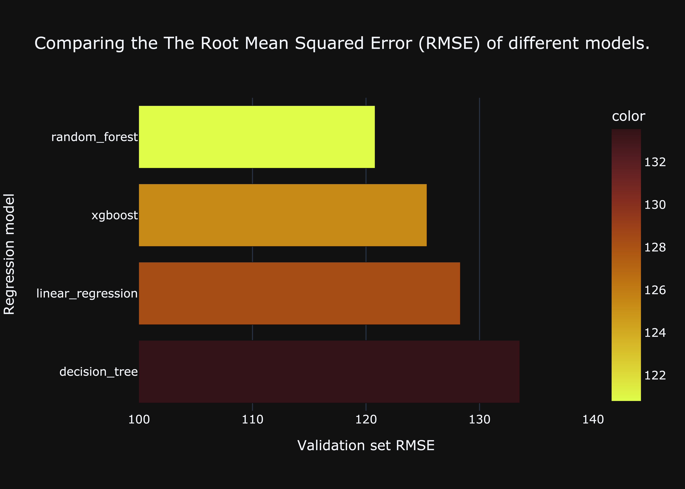
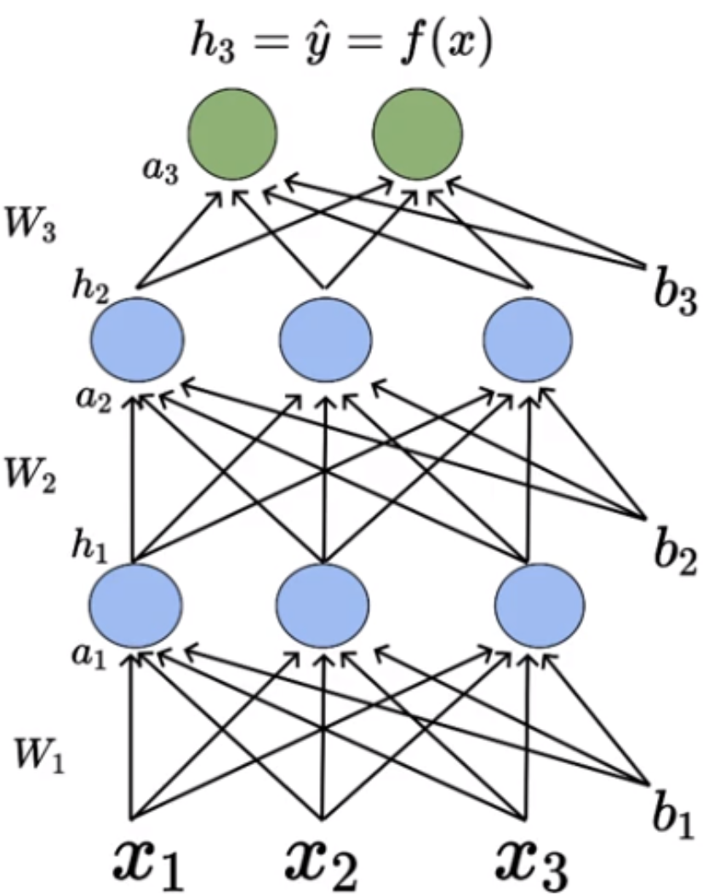
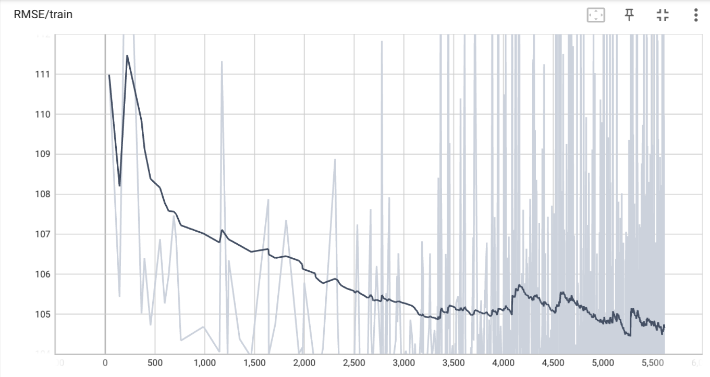

# Modelling Airbnb's Property Listing Dataset

Creating a multimodal deep learning structure that processes text, images and tabular data to predict the type of property from an Airbnb listing.


## Data preparation

<p align='center'>
  
</p>

> A Tableau dashboard showing initial insights into the data.

The 'structured' data is downloaded as a `.csv` file from an AWS S3 bucket containing the following information:
- `ID`: Unique identifier for the listing
- `Category`: The category of the listing
- `Title`: The title of the listing
- `Description`: The description of the listing
- `Amenities`: The available amenities of the listing
- `Location`: The location of the listing
- `Guests`: The number of guests that can be accommodated in the listing
- `Beds`: The number of available beds in the listing
- `Bathrooms`: The number of bathrooms in the listing
- `Price_Night`: The price per night of the listing
- `Cleanliness_rate`: The cleanliness rating of the listing
- `Accuracy_rate`: How accurate the description of the listing is, as reported by previous guests
- `Location_rate`: The rating of the location of the listing
- `Check-in_rate`: The rating of check-in process given by the host
- `Value_rate`: The rating of value given by the host
- `Amenities_count`: The number of amenities in the listing
- `URL`: The URL of the listing
- `Bedrooms`: The number of bedrooms in the listing

The file `tabular_data.py` contains the function `clean_data()` which will take a DataFrame as an input, and return a cleaned DataFrame. This is saved in the `dataframes` directory as `cleaned_dataset.csv`. A Tableau dashboard is created to take an overview at the data provided.

The function `create_numerical_dataset()` will drop all columns containing non-numerical data and `load_airbnb()` will return the tuple `(features, labels)` ready to train a regression model in the next section.


## Creating a regression model

The file `regression_modelling.py` will contain all the functions necessary to compare and select the best regression model used to predict the price per night of a listing. First, linear regression is used to calculate a baseline scores from the validation set:
- Validation RMSE: 128.31
- Validation R2 score: 0.31526

The function `tune_regression_model_hyperparameters()` will take a model, training, validation and testing sets, a dictionary of hyperparameter ranges to be tuned and a location of where to save calculated data as its parameters. Then, using `GridSearchCV` with a `KFolds` cross-validator, it will save the model, best parameters and performance metrics (RMSE and R2 score) to a folder in the `regression_models` directory. `evaluate_all_models()` will go through the models one by one and tune the respective hyperparameters, before `find_best_model()` will search through the `regression_models` directory and return the model with the lowest RMSE.

As can be seen from the chart below, the Random Forest Regressor has the lowest RMSE value out of the four models tested.

<p align='center'>
  
</p>

> A comparison of the RMSE of each model calculated from the validation set.


## Creating a classification model

`classification_modelling.py` contains all the functions needed to create and tune classification models used to predict the category (treehouse, chalet, offbeat, beachfront or amazing pools). It is almost identical to the file `regression_modelling.py`, with the regression models replaced with their classification counterpart. For these models, the price per night will also be included as a feature. Using logistic regression gives the baseline metrics from the validation set as:
- Validation accuracy score: 0.46296
- Validation precision score: 0.52363
- Validation recall score: 0.40310
- Validation F1 score: 0.38426

Comparing the four models demonstrates that XGBoost provides the most accurate results. It should be noted that XGBoost requires the labels to be a numeric value, and therefore a label encoder is used to map the categories to the label space `[0, 1, 2, 3, 4]`.

```python
label_encoder = LabelEncoder().fit(y)
label_encoded_y = label_encoder.transform(y)
```

> Encoding the label space using `LabelEncoder`.

<p align='center'>
  
</p>

> A comparison of the accuracy score of each model calculated from the validation set.


## Creating an FeedForward Artificial Neural Network

<p align='center'>
  
</p>

Feedforward neural networks are also known as Multi-layered Network of Neurons (MLN). These network of models are called feedforward because the information only travels forward in the neural network, through the input nodes then through the hidden layers and finally through the output nodes.

The Pytorch NN module will be used to create this model.

### Creating the DataLoader

The class `PriceNightDataset` is created as a subclass `torch.utils.data.Dataset` which covers the data in a tuple and enables the access the index of each sample, as well as the length of the datasets. This class also contains the assertion `len(X) == len(y)` to ensure that the features and targets are of equal length.

```py
dataset = price_night_Dataset(inputs, features)
```

> Creating the dataset from the `price_night_Dataset` class.

In deep learning, batches of data are used (usually as much as can fit onto a GPU). Using `torch.utils.data.DataLoader` as an iterable, the dataset is batched so it is more easily consumed by the neural network. The bath size will initially be set to a value of 100 and to be shuffled before each iteration, but the effect of different sizes and not shuffling will be inspected later in the project. 

```py
dataloader = DataLoader(dataset=dataset, shuffle=True, batch_size=100
```

> Creating the dataloader from the dataset.

### Creating the network architecture

The neural network is created as a class `FeedforwardNeuralNetModel` using Object Orientated Programming (OOP). The layers are defined in the `init` function and the forward pass is defined in the `forward` function, which is invoked automatically when the class is called. Using `super(FeedforwardNeuralNetModel, self).__init__`, these functions are possible as the class `nn.Module` from torch is inherited. Two linear hidden layers (`linear1` and `linear2`) are used with a `ReLU` activation function (`act1`).

N.B. `nn.Linear` takes a input shape and output shape and produces a weight and bias term for the specified shape.

### Instantiating the model

The input and output dimensions are determined by the number of features to targets, which in this case are 11 and 1 respectively. Determining the dimension of the hidden layer requires a little more thought. Too few hidden neurons and there is insufficient model capacity to predict competently. However a bigger model does not necessarily always equate to a better model. A bigger model will require more training samples to learn and converge to a good model (also called the curse of dimensionality), hence the optimal number will depend on the problem. There are many genereal 'rule-of thumb' methods such as:
- The number of hidden neurons should be between the size of the input layer and the size of the output layer.
- The number of hidden neurons should be 2/3 the size of the input layer, plus the size of the output layer.
- The number of hidden neurons should be less than twice the size of the input layer.

A single hidden layer containing 8 neurons will be used initially.

```py
model = FeedforwardNeuralNetModel(input_dim, hidden_dim, output_dim)
```

> Instantiating the model.

### Setting model parameters

1. `criterion = nn.MSELoss()`
    - As this is a regression problem, the Mean Squared Error (MSE) will be used as a loss function.
2. `optimiser = torch.optim.SGD(model.parameters(), lr=learning_rate)`
    - `optim.SGD` is used instead of manually manipulating the weights and biases, and the learning rate is set to 1e-5.
3. `epochs = 1500`
    - The number of iterations for training.

### Training the model

The model is trained by iterating through a `for` loop for each epoch:

1. Set gradient w.r.t. parameters to zero with the `.zero_grad` method
3. Predict an array of targets based on the features
4. Calculate loss
5. Calculate gradients w.r.t. parameters with the `.backward()` method
6. Update parameters using gradients with the `.step()` method

```py
for i in range(epochs):
  for x_train, y_train in dataloader:
    opt.zero_grad()
    pred = model(x_train)
    loss = criterion(pred, y_train)
    loss.backward()
    opt.step()
```

> The training loop.

### Tuning the parameters

<p align='center'>
  
  
</p>

> The Mean Square Error as the learning rate and number of hidden neurons is varied.

A smaller learning rate means the model takes a larger number of epoch to converge, however too small a learning rate will lead to unstable oscillations in the MSE. It seems for this model containing 8 neurons in the hidden layer, 1e-5 is the optimal learning rate.

Varying the the dimension of the hidden layer has a less pronounced effect: a larger number of neurons will lead to a faster convergence, however has a far longer computation time. Too few neurons and the model will not converge. As the improvement on final MSE with more a large number of neurons for this probelem is so small, the original number of 8 neurons will be used for the model.

After 300 epochs, this model gives a MSE of 16159.0, or a RMSE of 127.12. This is already an improvement on the linear regression model.

<p align='center'>
  
</p>

> This data can also be represented on TensorBoard.